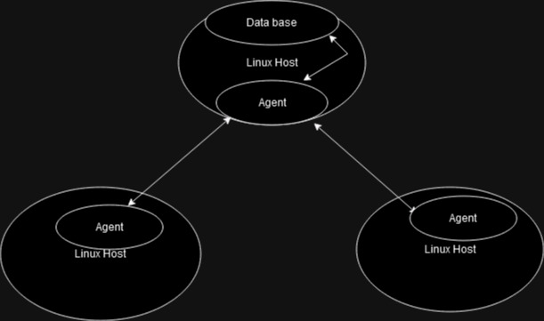

# Linux Cluster Monitoring Agent

# Introduction

This is a Bash script for monitoring hardware specification and resource usage, developed for use in monitoring remote or local servers. Data is collected from vmstat and lscpu commands and processed with commands such as awk/tail/head/xargs to parse the necessary information to insert in a persistent psql database. The database in this setup is stored within a docker container, which was tested in linux cloud vm environments. Git was chosen to host the code repository and for version tracking.

This project can be futher built on to provide consistent monitoring of server systems for analysis and resource usage alerts.

# Quick Start
Quick start command lines:
- Example to start a psql instance using psql_docker.sh, with username postgres and password password
  > ./scripts/psql_docker.sh create centos centos
  
  > ./scripts/psql_docker.sh start centos centos
  
- Example creating tables using ddl.sql
  >
  
- Example inserting hardware spec data into the DB using host_info.sh
  > INSERT INTO host_info (id, hostname, cpu_number, cpu_architecture, cpu_model, cpu_mhz, l2_cache, "timestamp", total_mem) VALUES (id, hostname, cpu_number, cpu_architecture, cpu_model, cpu_mhz, l2_cache, "timestamp", total_mem);
  
-  Example inserting hardware usage data into the DB using host_usage.sh
  > INSERT INTO host_usage ("timestamp", host_id, memory_free, cpu_idel, cpu_kernel, disk_io, disk_available) VALUES ("timestamp", host_id, memory_free, cpu_idel, cpu_kernel, disk_io, disk_available);

- Example Script Usage:
  > ./scripts/host_info.sh "localhost" 5432 "host_agent" "postgres" "password"
  
- Example Crontab setup, to run once a minute:
  > \* * * * * bash (Insert Path to Project File Here)/linux_sql/host_agent/scripts/host_usage.sh localhost 5432 host_agent username password > /tmp/host_usage.log

# Implemenation
## Architecture

## Scripts
Shell script description and usage (use markdown code block for script usage)
- psql_docker.sh
  Switch case for start, create and stop for setting up the psql docker container
  > ./scripts/psql_docker.sh create centos centos
  
  > ./scripts/psql_docker.sh start centos centos
  
- host_info.sh
  This script processes and sends information to the database regarding the current pc's specifications.
  > bash scripts/host_info.sh localhost 5432 host_agent postgres password
  
- host_usage.sh
  This script processes and sends information to the database regarding the cuirrent usage statistics.
  > bash scripts/host_usage.sh localhost 5432 host_agent postgres password
  
- crontab
  The following command sets up Chrontab to run the monitoring script once every minute, with /temp/host_uage.log used as a log file. 
   > \* * * * * bash (Insert Path to Project File Here)/linux_sql/host_agent/scripts/host_usage.sh localhost 5432 host_agent postgres password > /tmp/host_usage.log

- queries.sql (describe what business problem you are trying to resolve)
  The following command can be used to check tracked server resource usages per server. This raw information can be used to monitor resource usages and support analysis for better load balancing of servers.
   > SELECT * FROM host_usage;

  

## Database Modeling
Describe the schema of each table using markdown table syntax (do not put any sql code)
- `host_info`

| id       | hostname           | cpu_number  | cpu_architecture | cpu_model | cpu_mhz | l2_cache | timestamp | total_mem |
| ------------- |-------------  | ----- | ------------- |-------------  | ----- | ------------- |
| Serial id | Hostname of server | Number of cpus | CPU Architecture | CPU model | Size of l2 cache | Timestamp of record | Total memory |

- `host_usage`
  
| Timestamp       | host_id           | memory_free  | cpu_idle | cpu_kernel | disk_io | disk_available |
| ------------- |-------------  | ----- | ------------- |-------------  | ----- | ------------- |
| Timestamp of statistics | ID of host computer | Total free memory | Time spent idle | Kernel time | Time waiting for IO | Disk space available | 

# Test
Project had manual end to end testing, in linux command line terminal. Crontab was used to provide testing status updates each minute, with manual checks to make sure data was successfully inserted to the database. During testing, data was properly updated and inserted to the given databases.

# Deployment
The Linux Cluster Monitoring Agent was deployed 
How did you deploy your app? (e.g. Github, crontab, docker)
The code repository is stored in Github, which can be used for easy deployments in docker containers. Crontab can be used to schedule regular intervals of docker container monitoring updates sent to the database.

# Improvements
Future releases can include improvements to the program such as:
- An alert system if multiple calls or insert statements to the database fail, of if a failure is noticed.
- Implementing mail or other alert systems if usage or other statistics go above a set limit.
- Parsing of information could optimized futher.
